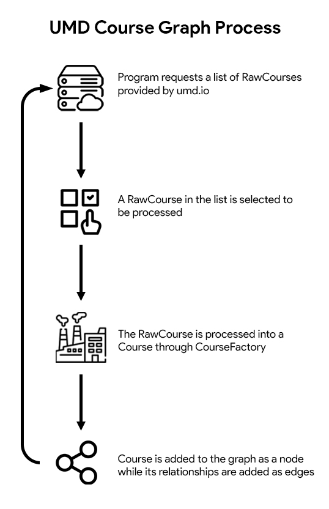

# UMD Course Graph

## A Java Maven project which uses the umd.io API to create a graph representing all of UMD's courses

This repository was built as the backend of UMD Course Web project.  The backend of this project interprets the data in University of Maryland's course directory (provided by umd.io's API) and processes the data into a directed graph.  The nodes of the UMD Course Graph represent every unique course.  The edges of UMD Course Graph represent different relationships between courses such as requisites of a course.  These course requisites were created by analyzing language patterns in keywords when scraping the course directory.  The end goal of this project is to allow for the data visualization of all courses provided by the University of Maryland.



## Installation Instructions

Follow these steps to include and use UMDCourseGraph in your own project.

### Prerequisites

Make sure you have the following installed on your system:
* [Java](https://www.java.com/en/download/)
* [Git Bash](https://git-scm.com/downloads)
* [Maven](https://maven.apache.org/download.cgi) (optional, if you would like to build the project)


### Cloning the Repository

1. Open Git Bash
2. In Git Bash, navigate to the directory where the project will be installed.
```
cd C:\Your\Specific\Directory
```
3. Clone the repository
```
git clone https://github.com/JohnN05/UMDCourseGraph.git
```

### Build the Project (optional)

1. Navigate to the project directory
```
cd C:\Your\Specific\Directory\UMDCourseWeb
```
2. Build the project using Maven
```
mvn clean install
```

## Find a bug?

If you found an issue or would like to submit improvements to this project, please submit an issue using the issues tab above.  If you would like to submit a pull request with a fix, please reference the issue you created.

## Known issues (Work in progress)
* Course currently doesn't handle section information
* Restrictions aren't considered in CourseFactory
* CreditReq isn't incorporated in RequisiteFactory
* Set Structure for Requisites may be flawed when they become more complex

## Authors

[JohnN05](https://github.com/JohnN05) - Developer

## License

This project is licensed under **GNU GPL-3.0** - see the [LICENSE](LICENSE) file for details